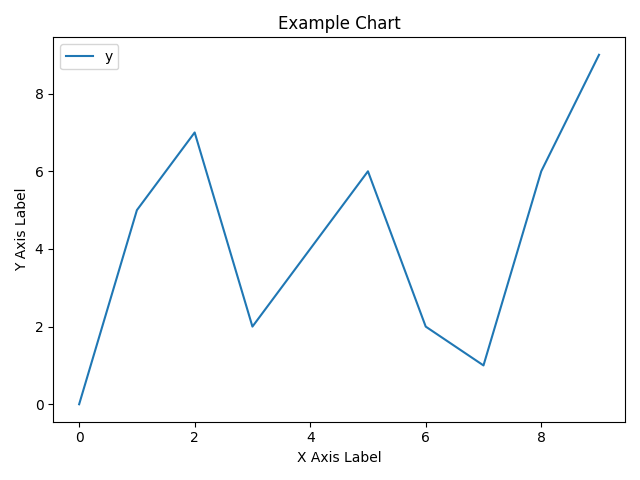
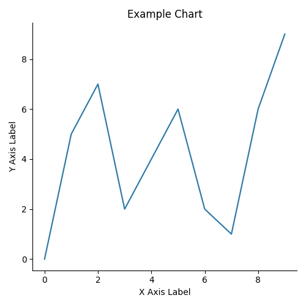
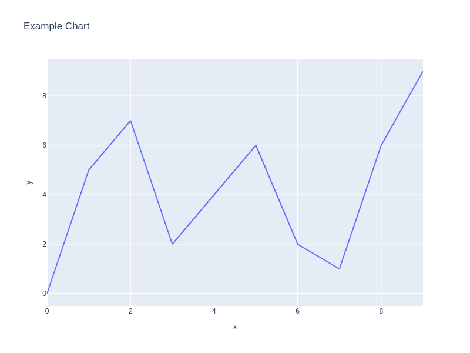

# Prettier Charts Project

> Small research project to identify a (potential) replacement for `matplotlib`
> for generating figures

## Table of Contents

- [Prettier Charts Project](#prettier-charts-project)
  - [Table of Contents](#table-of-contents)
  - [About](#about)
    - [Authors](#authors)
  - [How to Install](#how-to-install)
    - [Dependencies](#dependencies)
    - [Installation steps](#installation-steps)
  - [How to Run](#how-to-run)
  - [Results](#results)
    - [Figure Outputs and Data](#figure-outputs-and-data)
      - [Matplotlib](#matplotlib)
      - [Seaborn](#seaborn)
      - [Plotly](#plotly)
      - [Summary](#summary)
  - [Rankings](#rankings)

## About

This project is aimed at testing a variety of figure generating libraries to
identify if any of them are capable of replacing `matplotlib`.

All figures plot the same data (in `src/__init__.py`) as a line chart. All
figures have the same title, x-axis label, and y-axis label. All figures are
created using the minimum number of lines of code and imports.

We quantitatively compare the figures by:

- The number of lines of code to generate the figure (CLOC)
- The file size of the output figure (in bytes)
- The size of the figure (in pixels)

We qualitatively compare the figures by:

- Readibility
- Default style

We understand and accept that not everyone will agree with out qualitative
assessments, however, we consider this project on a limited scope representative
of the work being conducted within the Loyola University Chicago Software and
Systems Laboratory.

The follwoing libraries were tested:

- Matplotlib
- Seaborn
- Plotly

### Authors

- Anna Grigores
- Nicholas M. Synovic

## How to Install

We have tested this code on Linux x86-64 computers.

### Dependencies

This project is dependent upon:

- Python 3.10

### Installation steps

1. `make create-dev`
1. `make build`

## How to Run

1. `cd src`
1. `ls test_*.py | xargs -I % python %`
1. `python generateMetrics.py`

## Results

The following section contains the results of our work as well our findings

### Figure Outputs and Data

The following subsections contain the quantitave results per figure and
generating code. A summary can be found within the [Summary](#summary) section
of this document.

#### Matplotlib

- CLOC:
- Figure file size:
- Figure pixel count:

#### Seaborn

- CLOC:
- Figure file size:
- Figure pixel count:

#### Plotly

- CLOC:
- Figure file size:
- Figure pixel count:

#### Summary

TODO create summary fig

## Rankings

1. Seaborn. It looks good and was the easiest to use. It had high visibility for
   text and subtle grid lines, and it was very straightforward to make.
1. Matplotlib. It looks very plain, but was simple to implement. It didn't
   require any extra imports.
1. Plotly. While it looks good, it had low text visibility and was difficult to
   save as a png rather than an html file.
